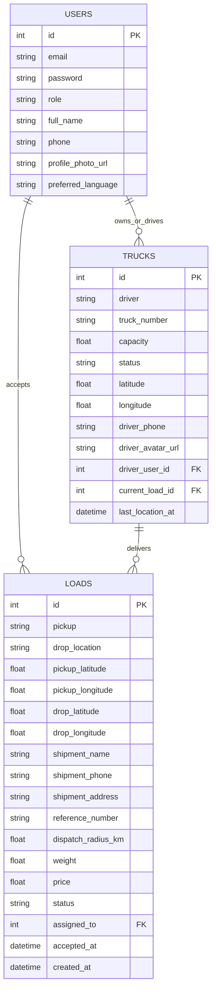
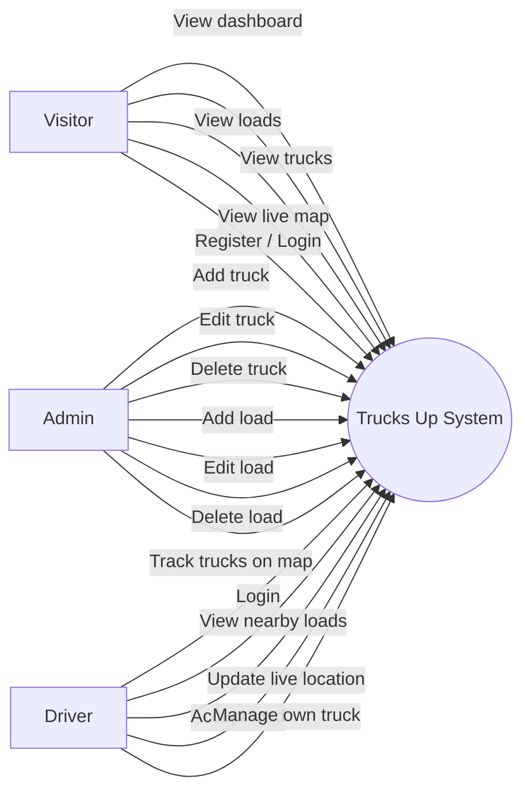
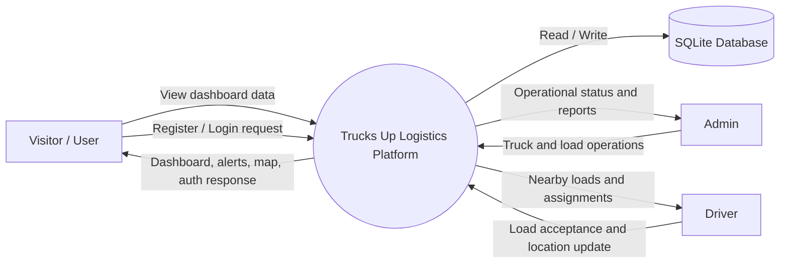
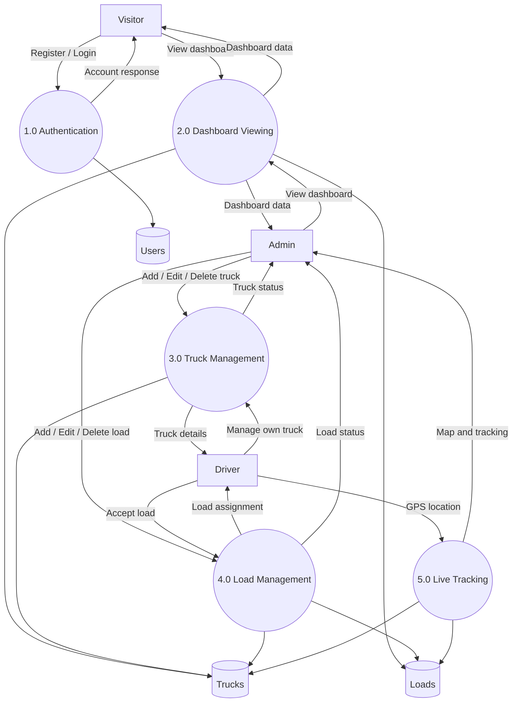
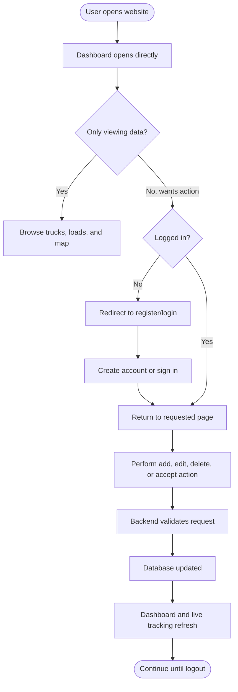
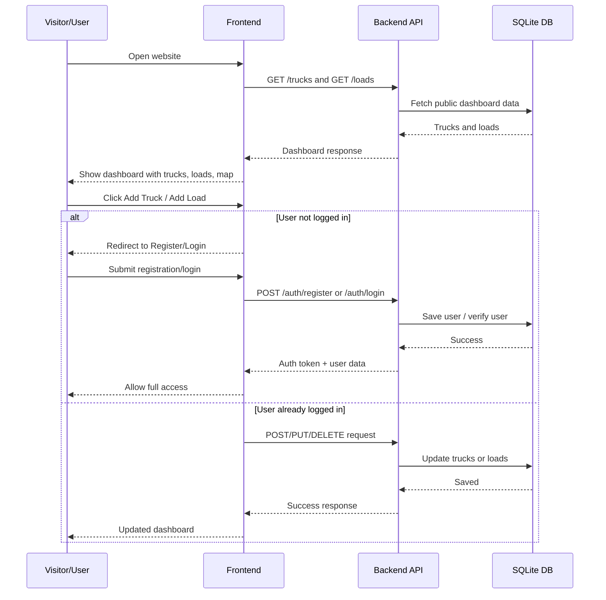

# Trucks Up PPT Diagrams

Use the following Mermaid diagrams directly in Markdown editors that support Mermaid, or copy the structure into draw.io / PowerPoint shapes.

## ER Diagram

## Use Case Diagram

## DFD Level 0

## DFD Level 1

## Activity Diagram

## Sequence Diagram

## Short PPT Notes

- Problem statement: manual truck and load coordination causes slow dispatch and poor visibility.
- Solution: Trucks Up gives one dashboard for trucks, loads, driver assignment, and live tracking.
- Key feature: dashboard is visible immediately, but data-changing operations require user registration/login.
- Technology summary: React frontend, Node.js/Express backend, SQLite database, Socket.IO live updates, Leaflet map tracking.
